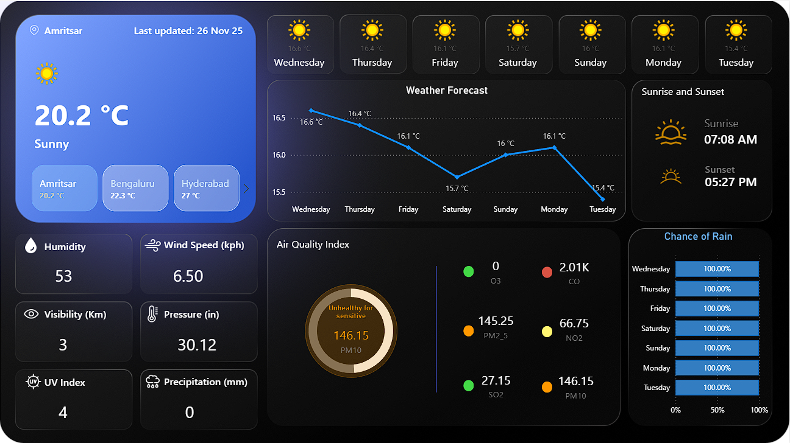

# Weather & Air Quality Dashboard

A visually rich Power BI dashboard that consolidates real-time weather, 7-day forecasts, sunrise/sunset times, and detailed air quality metrics (AQI & pollutant breakdown) into a single, easy-to-read interface.

---

## Table of Contents

- [Preview](#preview)
- [Features](#features)

---

## Preview

---

## Features

### 🔹 Current Weather Overview
- Displays real-time temperature, weather condition, and city.
- Shows last updated timestamp.
- Quick-switch city buttons (e.g., Amritsar, Bengaluru, Hyderabad).

### 🔹 Key Weather Metrics
- Humidity  
- Wind Speed (kph)  
- Visibility (km)  
- Pressure (in)  
- UV Index  
- Precipitation (mm)

### 🔹 7-Day Weather Forecast
- Temperature trend line chart.
- Daily weather icons (sunny, cloudy, etc.).
- High/low temperature details.

### 🔹 Sunrise & Sunset Panel
- Clean display of daily sunrise and sunset times.

### 🔹 Air Quality Index (AQI)
- Circular AQI gauge with color-coded health status.
- Pollutant values including:
  - PM10  
  - PM2.5  
  - CO  
  - NO₂  
  - SO₂  
  - O₃  
- Health category indicators (good, moderate, unhealthy, etc.).

### 🔹 Chance of Rain
- Horizontal bar chart showing precipitation probability for each day of the week.

---

